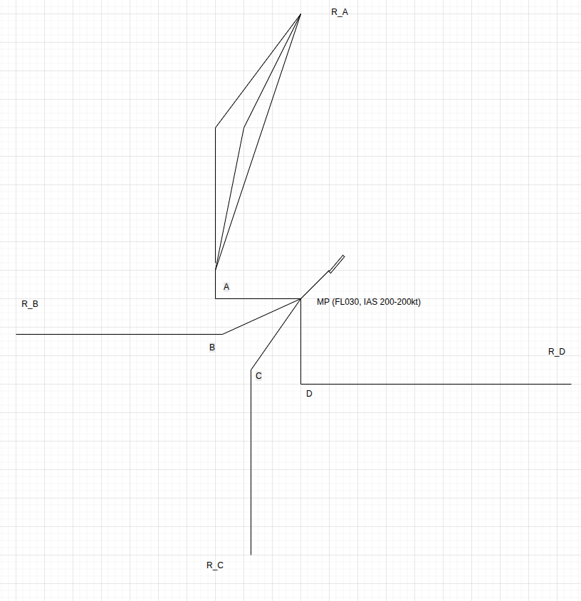

Ideas

## 1. i4D on-board  
### 1.1 Time constraint with +/- 10 seconds 95% of the time

### 1.2 The aircraft FMS will be able to downlink the whole 4D trajectory flight plan with the associated predictions—e.g. predicted aircraft weight, as well as the predicted horizontal and vertical speed—of up to 128 waypoints, so called extended projected profile (EPP), via automatic dependent surveillance-contract (ADS-C).

### 1.3 QUESTUIONS : IDLE CDO: HOW TO PREDICT the trajectory. Since we do not have a i4D FMS(or simulated one.)

## 2. Ground ATC 
### The GROUND ATC arrival planner  generates the CTA(RTA) for specified aircraft and the route(Closed LOOP)

Assume the arriavl traffic has enough longitudial space?

### 3. I am learning  MPC.

The airbus has Managed Descent (DES),  OP DES,  V/S, FPA, 

