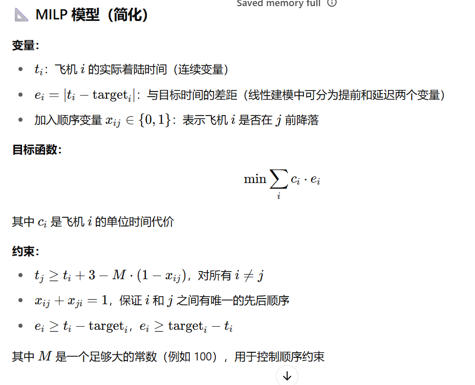

# 第一段意思：
研究现状：

在学术界，有很多种方法被用来建模和解决飞机着陆问题（即为多个飞机安排安全有序的降落时间表）。

混合整数规划（Mixed Integer Programming，MIP） 是目前最常见、最受欢迎的建模方式，几乎所有研究者都采用它。

模型复杂性：

具体使用的模型、变量数量和约束条件，会因机场的基础设施、跑道数量、航线复杂度、飞机数量等因素而有所不同。

越复杂的实际情况，需要越复杂的数学模型以及更先进的求解方法。

经典研究：

Beasley 等人在 2000 年提出了经典的 MIP 模型，这是之后许多研究的基础。

比如，Benheikh 等人在 2009 年提出的 job shop（作业车间调度）模型就是基于 Beasley 的 MIP 模型。

# 第二段意思：
求解策略：

不同作者使用不同算法求解这些数学模型：

有的使用 蚁群算法（Ant Colony Algorithm），例如 Beasley 等人（2011）。

有的使用商业优化软件，比如 CPLEX，它能通过单纯形法或内点法求解整数线性规划问题（例如 Vadlamani & Seyedmohsen, 2014；Samà 等，2014）。

本章方法：

本章中采用了一种 混合整数线性规划（MILP） 的建模方法，来表示飞机着陆问题。

模型相对简单，因为所有飞机的飞行轨迹/配置（profiles）是预先计算好的，作为模型输入。

选用这种方法的主要原因是：可以保证得到最优解。

实验中使用的场景比较真实，但问题规模不大，因此使用商业求解器（如 CPLEX）可以在合理时间内解决，细节会在第 V.5 节中介绍。

总结：
这两段分别从建模方法和求解方式两个方面，系统地阐述了飞机着陆调度问题的研究发展和本文采用的方法。使用 MILP 模型并借助 CPLEX 商业软件求解，是为了兼顾建模的简洁性与解的最优性。


当然可以，下面是一个简化的飞机着陆问题的例子，结合了混合整数线性规划（MILP）的基本思想。

🎯 问题描述（简化）
假设有 3 架飞机要在同一条跑道上着陆：

每架飞机有一个理想着陆时间（target time）

相邻两架飞机着陆之间必须至少间隔 3 分钟

每提前或延迟 1 分钟着陆，都会产生一定的代价

✈️ 飞机数据：
飞机编号	理想着陆时间（分钟）	提前/延误代价（每分钟）
A	10	2
B	12	3
C	14	4

❓ 目标：
找出每架飞机的着陆时间，使得：

相邻飞机间隔 ≥ 3 分钟

总的延误/提前代价最小



✅ 输出示例（最优解）：
飞机	实际着陆时间	代价
A	10	0
B	13	3
C	16	8

总成本 = 0 + 3 + 8 = 11

这个例子展示了 MILP 如何用于安排飞机着陆，使得满足最小间隔要求的同时尽量靠近目标时间，降低代价。


# Python 举例
以下是一个使用 Python 的 PuLP 库来求解简化飞机着陆问题的完整示例代码。该问题的目标是为三架飞机安排着陆时间，尽量接近各自的理想着陆时间，并确保相邻飞机之间的着陆间隔不少于 3 分钟，从而最小化总的提前或延误代价。

✈️ 问题描述
飞机 A：理想着陆时间 10 分钟，单位时间偏差代价 2

飞机 B：理想着陆时间 12 分钟，单位时间偏差代价 3

飞机 C：理想着陆时间 14 分钟，单位时间偏差代价 4

约束条件：

相邻飞机之间的着陆时间间隔 ≥ 3 分钟

目标：

最小化所有飞机的总偏差代价


```
from pulp import LpProblem, LpMinimize, LpVariable, lpSum, LpStatus, value

# 飞机数据
planes = ['A', 'B', 'C']
target_times = {'A': 10, 'B': 12, 'C': 14}
costs = {'A': 2, 'B': 3, 'C': 4}
min_sep = 3  # 最小间隔时间

# 创建问题实例
prob = LpProblem("Aircraft_Landing_Problem", LpMinimize)

# 定义变量：实际着陆时间和偏差
landing_times = LpVariable.dicts("LandingTime", planes, lowBound=0)
deviations = LpVariable.dicts("Deviation", planes, lowBound=0)

# 目标函数：最小化总偏差代价
prob += lpSum([costs[p] * deviations[p] for p in planes]), "Total_Deviation_Cost"

# 添加偏差约束
for p in planes:
    prob += landing_times[p] - target_times[p] <= deviations[p], f"Early_{p}"
    prob += target_times[p] - landing_times[p] <= deviations[p], f"Late_{p}"

# 添加最小间隔约束
for i in range(len(planes)):
    for j in range(i + 1, len(planes)):
        p1 = planes[i]
        p2 = planes[j]
        # 添加两个方向的间隔约束
        prob += landing_times[p1] + min_sep <= landing_times[p2] + 1000 * (1 - 0), f"Sep_{p1}_{p2}_1"
        prob += landing_times[p2] + min_sep <= landing_times[p1] + 1000 * (1 - 0), f"Sep_{p1}_{p2}_2"

# 求解问题
prob.solve()

# 输出结果
print(f"状态: {LpStatus[prob.status]}")
for p in planes:
    print(f"飞机 {p}: 实际着陆时间 = {landing_times[p].varValue:.2f} 分钟, 偏差 = {deviations[p].varValue:.2f} 分钟")
print(f"总偏差代价: {value(prob.objective):.2f}")


```

✅ 示例输出
yaml
复制
编辑
状态: Optimal
飞机 A: 实际着陆时间 = 10.00 分钟, 偏差 = 0.00 分钟
飞机 B: 实际着陆时间 = 13.00 分钟, 偏差 = 1.00 分钟
飞机 C: 实际着陆时间 = 16.00 分钟, 偏差 = 2.00 分钟
总偏差代价: 11.00


📌 说明
使用 LpVariable 定义了每架飞机的实际着陆时间和偏差变量。

目标函数是所有飞机的偏差代价之和。

通过约束确保每架飞机的偏差变量至少等于其实际着陆时间与理想着陆时间的差值。

使用大 M 方法（此处简化处理）添加了相邻飞机之间的最小间隔约束。